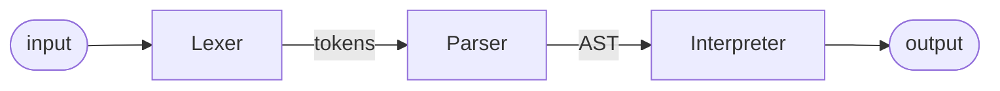

# py-math-interpreter
A simple math expression interpreter written in Python for learning purposes.

## Interpreter structure
- **Lexer**: performs the *lexical analysis*, converting a sequence of characters into a sequence of lexical tokens. A lexical token or token is a string with an assigned and thus identified meaning. It is structured as a pair consisting of a token name and an optional token value.

- **Parser**: performs the *syntax analysis*. Uses the stream of tokens to check the syntactic structure of the input and generate the AST (Abstract Syntax Tree). The implemented parser is a **Recursive Descent Parser**: top-down parser built from a set of mutually recursive functions where each function implements one of the non-terminals of the grammar.

- **Interpreter**: interprets the AST on the fly (without compiling it) and produces the result of the mathematical expression.



## Execute the program
### Main (executes an example)
```bash
user@host:~$ make run_main
```

### Lexer
```bash
user@host:~$ make run_lexer
```

### Parser
```bash
user@host:~$ make run_parser
```

### Interpreter
```bash
user@host:~$ make run_interpreter
```

## Execute the tests
```bash
user@host:~$ make tests
```

## References
Some really helpful references that I used:
- Toptal. [Writing an interpreter](https://www.toptal.com/scala/writing-an-interpreter)
- CodePulse. [Simple math interpreter](https://www.youtube.com/playlist?list=PLZQftyCk7_Sdu5BFaXB_jLeJ9C78si5_3)
